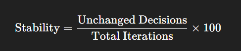

# 🎓 Explainable Student Performance Analysis System

## 📌 Overview

This project implements a **rule-based Explainable AI system** to analyze student performance and predict whether a student will **PASS or FAIL**.

Unlike traditional ML models, this system is:

* ✅ Fully **rule-based (no training)**
* ✅ **Explainable**
* ✅ **Deterministic + probabilistic hybrid**
* ✅ Designed for **interpretability and academic use**

---

## 🚀 Key Features

### 🔹 1. Single Student Analysis

Analyze an individual student with complete reasoning.

**Outputs:**

* ✔ Final Decision (PASS / FAIL)
* ✔ Confidence Score (%)
* ✔ Stability / Robustness (%)
* ✔ Rule-based explanation (human-readable)
* ✔ Feature impact (what affected decision)

---

### 🔹 2. Bulk Analysis (CSV Upload)

Analyze an entire dataset at once.

**Capabilities:**

* Process 400+ students
* PASS/FAIL prediction for each student
* Confidence & Stability scores
* Summary dashboard
* Performance distribution charts
* Filtering (PASS / FAIL / Low confidence)
* Identify high-risk students
* Export results as CSV

---

### 🔹 3. Explainability (Core Feature)

The system explains **why** a decision was made using:

* ✔ Rule-based reasoning
* ✔ Predefined natural-language explanations
* ✔ No ambiguous symbol parsing
* ✔ No contradictory outputs

---

### 🔹 4. Confidence (Softmax-Based)

Confidence is computed using **temperature-scaled softmax** over rule scores:


Where:
* ( S_{pass}, S_{fail} ) = rule-based scores
* ( T ) = scaling factor

👉 This ensures:

* No extreme 0% / 100% bias
* Proper reflection of evidence dominance

---

### 🔹 5. Stability / Robustness

Uses **Monte Carlo simulation with fact-level perturbation**.

* Input values are modified across logical boundaries
* System checks if decision changes

**Output:**

---

### 🔹 6. Confidence Sensitivity

Measures how confidence reacts to perturbations:

👉 Helps detect:

* Overconfident predictions
* Fragile decision regions

---

### 🔹 7. Feature Impact Analysis

Tracks which features caused decision flips during perturbation.

Example:

```text
attendance → influenced decision 12 times
studytime → influenced decision 8 times
```

---

## 🧠 Core Concepts Used

### ✔ Logic & Reasoning

* Propositional logic (A, B, C facts)
* Rule-based inference system

### ✔ Mathematical Modeling

* Weighted scoring system
* Evidence aggregation

### ✔ Probability

* Softmax (normalized confidence)
* Evidence-based interpretation

### ✔ Simulation

* Monte Carlo perturbation
* Sensitivity analysis

---

## ⚙️ System Workflow

```text
Input Data
   ↓
Fact Extraction (A, B, C…)
   ↓
Rule Evaluation
   ↓
Score Computation (PASS / FAIL)
   ↓
Decision Making
   ↓
Confidence Calculation (Softmax)
   ↓
Stability Analysis (Perturbation)
   ↓
Explanation Generation
```

---

## 📊 Dataset

* File: `student-mat.csv`
* Used only as **input data**
* No model training involved

---

## 🖥️ User Interface

Built with **Streamlit**

### Modes:

* 🔍 Single Student Mode
* 📊 Bulk Analysis Mode

### Features:

* Interactive dashboard
* Data visualization
* File upload
* Real-time analysis

---

## 📁 Project Structure

```
project/
│
├── app.py                 # Main Streamlit UI
├── rules.py               # Fact extraction & rules
├── utils.py               # Rule evaluation & scoring
├── confidence.py          # Softmax confidence
├── stability.py           # Robustness analysis
├── student-mat.csv        # Dataset
└── README.md
```

---

## ▶️ How to Run

### 1. Install dependencies

```bash
pip install streamlit pandas
```

### 2. Run the app

```bash
streamlit run app.py
```

### 3. Open in browser

```
http://localhost:8501
```

---

## 🎯 Key Advantages

* ✔ Fully explainable (no black box)
* ✔ Handles conflicting rules
* ✔ Provides confidence + stability
* ✔ Works without training data
* ✔ Easy for teachers to interpret

---

## ⚠️ Limitations

* Rule-based → depends on rule quality
* Not data-trained (no learning)
* Requires manual tuning of rules

---

## 🔮 Future Improvements

* Hybrid model (rules + ML)
* Adaptive rule weighting
* Feature importance visualization
* Decision boundary visualization
* Automated rule learning

---

## 🎓 Conclusion

This system demonstrates how **logic + probability + simulation** can be combined to create a **transparent AI system** for real-world decision support.

It emphasizes:

> Explainability over black-box prediction.

---


